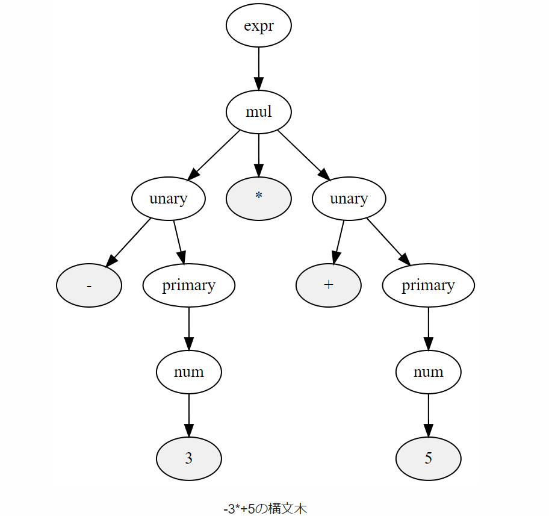

# C コンパイラ入門

## 整数 1 個のコンパイル

- コンパイラの概要
  c 言語 -> (IL: LLVM の中間言語) -> .s (assembly) ファイル -> .o (object) ファイル -> リンク -> バイナリ

## トークナイズ

"1 + 1" => ["1", "+", "1"]

- 連結リスト
- 前のトークンが次のトークンの情報をもつ
- 例: トークン配列

```C
  ["1", "+", "1"]
  "1".next -> "+".next -> "1"
  // ポインター
  Token.next -> Token
```

- 構文解析を行うもの
- 空白文字を処理したい

## 演算子の優先順位

```C
1        +    (1      +      1)
            expr
             |
            mul: ["1", "+", "(1 + 1)"]
  /          |    \
primary     "+"   primary
|            |       \
|            |        \
num         "+"      expr
                       |
                      mul: ["1", "+", "1"]
                 /     |     \
             primary  "+"   primary
                |      |       \
                |      |        \
               num    "+"       num
```

```EBNF
  expr    = mul ("+" mul | "-" mul)*
  mul     = primary ("*" primary | "/" primary)*
  primary = num | "(" expr ")"
```

- [history](https://github.com/rui314/chibicc/commits/main?after=90d1f7f199cc55b13c7fdb5839d1409806633fdb+306)

- [ref commit](https://github.com/rui314/chibicc/tree/725badfb494544b7c7f1d4c4690b9bc033c6d051)

## パーサー

- C プログラム → トークンに分類 → 構文木に変換 (パース)
- parse = トークンを木構造に分類すること

```Rust
Vec<Token> -> Tree<Node>
```

- expr = explore, 数式 $(1 + (1 + 1) + (2* 2 + 3)) - 9$
- ここは、比較演算をパースしている
- 実行順は番号順だが、計算は 7 → 1 となる
- () で expr、つまり一つの数式と見る



```EBNF
|
2-1. program = stmt*

2-2. stmt = expr-stmt

2-3. expr-stmt = expr ";"
|
1. expr = equality

2. equality = relational ("==" relational | "!=" relational)*

3. relational = add ("<" add | "<=" add | ">" add | ">=" add)*

4. add = mul ("+" mul | "-" mul)*

5. mul = unary ("*" unary | "/" unary)*

6. unary = ("+" | "-") unary
      | primary

7. primary = "(" expr ")" | num
```

- x86_64

```assembly
  .globl main
main:
  mov $1, %rax    // rax = 1
  push %rax       // mem = rax
  mov $2, %rax    // rax = 2
  pop %rdi        // rax = mem
  cmp %rdi, %rax  // rax == rdi -> set equal flag register
  setle %al       //  al = less than equal result
  movzb %al, %rax // rax = al (bit extend with zero: 16bit -> 64bit)
  // この段階でスタックフレームはリターンアドレスのみ。
  ret             // 複合命令で pop rax -> jmp rax
```

- 参考: RISC-V

```riscv
.text
main:
  la   $s0, A              # load variables A and B into registers
  lw   $s0, 0($s0)
  la   $s1, B
  lw   $s1, 0($s1)
```

## 変数の扱い

- RSP = Register Stack Pointer(current stack position)
- RBP = Register Base Pointer(current stack frame start position)

$y = f(g(x))$

y = f() {
g(x)
}

- 原理はパースと一緒
- $y = f(g(x))$ は、g を先に求める。
  よって、fn g を実行 → f を呼び出すことになる。

```c
void g() {
  int x = 1;
  int y = 2;
  f();
}

void f() {
  int a = 3;
  int b = 4;
}
```
